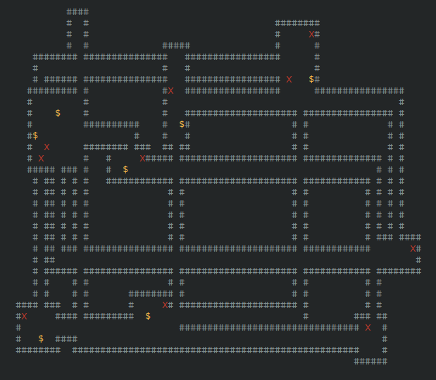
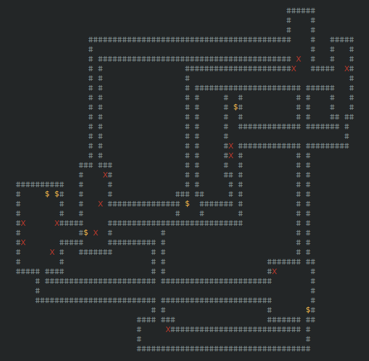

<div align="center">
  <h1>dun-gen</h1>
</div>

A compact C++ program that generates 2D grid-based dungeons using pseudo-random algorithms. The output simulates rooms, corridors, enemies, and chests, rendered as ASCII art.

Originally built just for fun — now a neat way to explore procedural generation in a minimalist format.

## Screenshots

<p align="center" style="display: flex; flex-wrap: wrap; justify-content: center; gap: 2px;">
  
  <br/>
  
</p>

## Output Storage

After each run, the generated dungeon is automatically saved as a plain text file in the `outputs/` directory.

Each file is named using the current system time, in the format:

```
outputs/YYYY-MM-DD_HH-MM-SS.txt
```

The output contains an ASCII representation of the dungeon layout, using characters like `#` for walls, spaces for floor tiles, `X` for enemies, and `$` for chests. These files can be opened with any text editor for inspection, sharing, or further use.

## Build & Run

### Prerequisites

- A C++17 or newer compatible compiler (e.g., `g++`, `clang++`)
- `make` (for using the provided `Makefile`)

### Build

```bash
make
````

This will compile the source files and create the executable in the `bin/` directory.

### Run

```bash
bin/dun-gen [options]
```

### Options

| Flag     | Description             | Default |
| -------- | ----------------------- | ------- |
| `-w`     | Set canvas width        | 80      |
| `-h`     | Set canvas height       | 40      |
| `-min`   | Minimum room size       | 4       |
| `-max`   | Maximum room size       | 10      |
| `-r`     | Maximum number of rooms | 10      |
| `--help` | Show help message       |         |

Example:

```bash
bin/dun-gen -w 100 -h 50 -min 5 -max 12 -r 15
```

## Project Status

This project is no longer actively maintained or developed in its current form. Feel free to fork, adapt, or build on top of it.

## License

This project is released under the [MIT License](./LICENSE).
